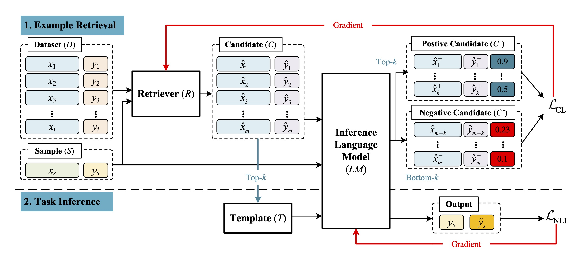

# Instruction Tuning with Retrieval-based Examples Ranking for Aspect-based Sentiment Analysis




For a target sample, for example, *The _falafel_ was slightly **overcooked** and **dry**, but the _chicken_ was **satisfactory***, the example *The _price_ was too **high**, but the _cab_ was **amazing*** can be appropriate. They share a similar syntactic structure, which can contribute to imitation and generation. However, such an example is unsuitable for another sample, for example, *The _staff_ displays **arrogance**, and the _prices_ are considerably **high** for Brooklyn standards*. Because the opinion of **high** in the example may finally impact the judgment of the aspect _price_ of the target. Furthermore, the sample *We **enjoyed** our _visit_ and utilized buses and cabs for transportation* seems to have little relevance to the example above. However, the aspect _cab_ may be incorrectly considered an aspect term based on the prompt of the word _cab_ in the example.


## Requirements
Install all required python dependencies:
```
pip install -r requirements.txt
```

## Datasets

This section describes the format of the data required for the training and evaluation of the datasets using our approach. For all subtasks, the field names should match exactly as shown and have the same datatypes. The fields to be present in the raw dataset are as follows:

-- ```raw_text```: This is the reviews section (str)

-- ```aspectTerms```: This is the set of aspect terms and their polarities to be present as a list of dictionaries. Each dictionary will have atleast two keys with the one of the key ```term``` and the value which is an aspect in the corresponding sentence. The second key will be ```polarity``` and its value is the polarity for corresponding aspect. (```[{'term':'aspect1', 'polarity':'polarity1'}, ...]```)

>**Warning**
>When creating the dataset in this fashion and saving it, ```.xlsx/.csv``` format will convert the aspectTerms column into ```string/text``` format. But the package will handle that when loading the dataset file. 

An example dataset is shown below and also in the [Datasets](https://github.com/kevinscaria/InstructABSA/tree/main/Dataset) folder.
| raw_text  | aspectTerms |
| ------------- | ------------- |
| The cab ride was amazing but the service was pricey  | [{'term':'cab ride', 'polarity':'positive'}, {'term':'service', 'polarity':'negative'}]  |
| I ordered the Barbeque Pizza | [{'term':'noaspectterm', 'polarity':'none'}] |

## Instructions

### Train
```
python ../run_model.py -mode train -model_checkpoint google/flan-t5-base \
-experiment_name aste_res14 -task aoste -output_dir ../Models \
-inst_type 2 \
-set_instruction_key 2 \
-id_tr_data_path ../Dataset/ASTE/res14/train.csv \
-id_te_data_path ../Dataset/ASTE/res14/dev.csv \
-per_device_train_batch_size 2 -per_device_eval_batch_size 2 -num_train_epochs 4 \
```


### Eval
```
python ../run_model.py -mode eval -model_checkpoint ../Models/aoste/googleflan-t5-base-aste_res14 \
-experiment_name aste_res14 -task aoste -output_path ../Output \
-inst_type 2 \
-set_instruction_key 2 \
-id_tr_data_path ../Dataset/ASTE/res14/train.csv \
-id_te_data_path ../Dataset/ASTE/res14/test.csv \
-per_device_train_batch_size 16 -per_device_eval_batch_size 16 -num_train_epochs 4 \
-k 4
```

## BibTeX Entry and Citation Info


